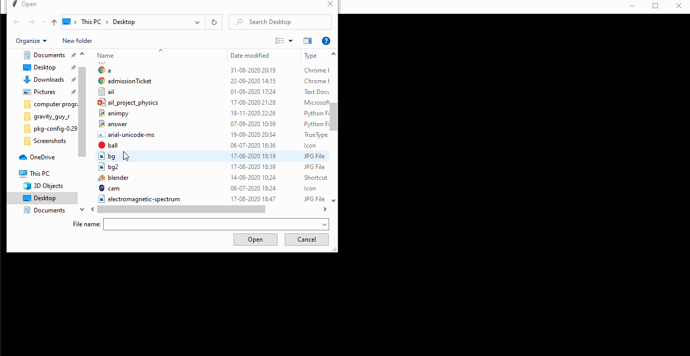

# picpydit
A photo editor made with python.
Made with tkinter. can also be used to add effects to gifs but they will be applied to the entire file. fps is for gifs.
creates temporary files, so make sure decent amount of extra space is available.

